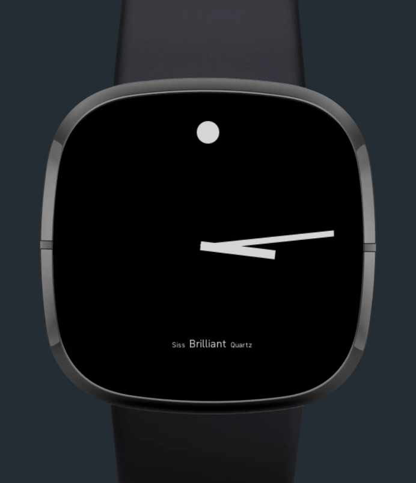

# Brilliant Watch
Fitbit watch by Nate Brill
https://github.com/nhbrill/brill-watch

## Required Developer Software
1. Node.js 14
2. nvm
3. Fitbit Sense or Fitbit OS Simulator

## Running Locally
Clone the repo ```https://github.com/nhbrill/brill-watch.git```
1. ```npx fitbit```
2. fitbit$ ```build```
3. fitbit$ ```install```
4. See changes on watch or simulator.

## Create Watch Template
1. ```npx create-fitbit-app my-first-clock```
   - ? What type of application should be created? ```clockface```
   - ? What should the name of this application be? ```Brill Watch```
   - ? Should this application contain a companion component? ```No```
   - ? Which platforms should this application be built for? ```Fitbit Versa 3, Fitbit Sense```

## Functionality
Watch is based on Movado Museum, second hand is not present.


