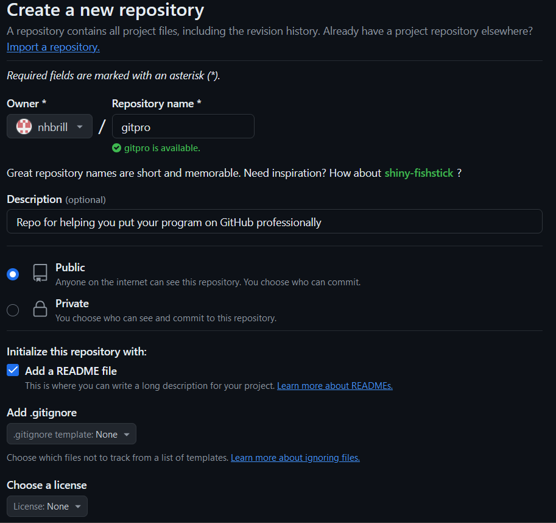
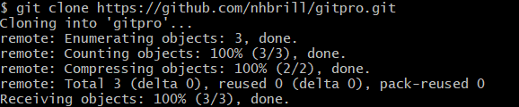
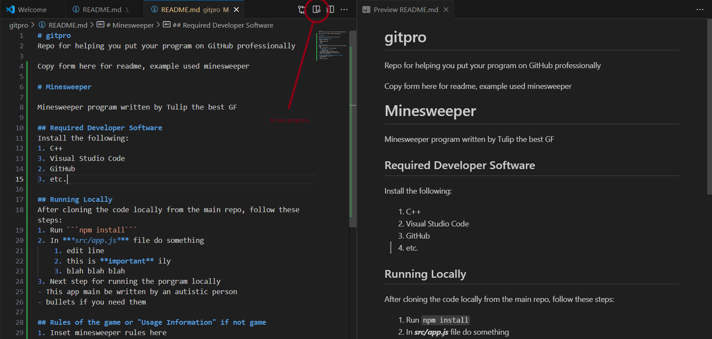

# Git-Pro

Repo to make github repos look professional https://github.com/nhbrill/gitpro.git <br />
Copy the text in ```README - Example.md``` and paste in readme created in repo

## Required Developer Software
Install the following:
1. Visual Studio Code and GitHub

## Running Locally
After cloning the code locally from the main repo, follow these steps:
1. Create Repo


2. Clone repo


3. In you repo folder add your files for the repo
    1. drop files in or upload directly on github.
    2. this is **important** make sure to commit and push
    3. type ```git status``` to see if they were added
4. Edit ```README.md```


5. what to do next
    1. ```git add .```
    2. ```git commit -m "initial commit"```
    3. ```git push```

