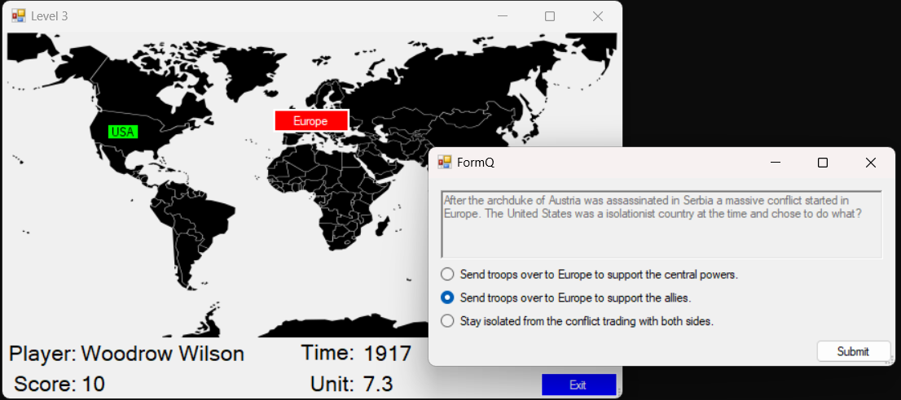

# United States History Game
A game mapping the conflicts throughout history of the United States of America. Can be used for studying purposes or for fun. https://github.com/nhbrill/united-states-history-game

## Required Developer Software
1. C#

## Running Locally
Clone the repo ```https://github.com/nhbrill/united-states-history-game.git```
1. Open the shortcut in main folder labeled APUSH_GAME.lnk or open obj/APUSH.exe

## Functionality
Click the red buttons around the world and select the correct historical approach.


